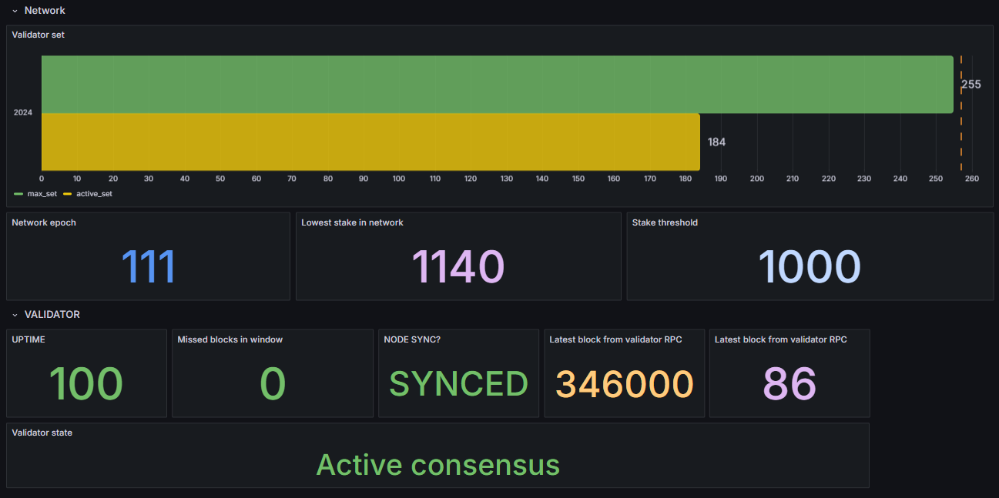

# 🟡 namada-exporter

## About 

The **namada-exporter** is a tool designed to integrate with Namada network, enabling efficient monitoring for Prometheus.

Pre-built Grafana dashboard for the namada-exporter are available and detailed in a section below.

For an example of the metrics exposed by the namada-exporter, refer to the [metrics.example](metrics.example) file.

## Prerequisites

### Dependencies
Run the following command to install the necessary packages.

```bash
apt-get install -y git curl clang libssl-dev protobuf-compiler pkg-config
```

### Install Rust
The namada-exporter is built using Rust. Follow these steps to install Rust and Cargo.

Install rustup.
```sh
curl --proto '=https' --tlsv1.2 -sSf https://sh.rustup.rs | sh
```
Restart your current shell to reload the PATH environment variable, or source the environment file.
```sh
. "$HOME/.cargo/env" 
```

Verify the installation.
```sh
cargo --version
rustc --version
```

# 🚀 Getting Started

Clone the repository to your local machine.
```sh
# Clone this repository, copy the URL from the Code button above.
git clone <copied-url>
cd <repository-name>
```

Build the project using Cargo. The binaries will be compiled and available at `target/release/namada-exporter`.
```sh 
cargo build --release
```

Create a configuration file by copying the example file, then update `config.toml` with your specific settings.
```sh 
cp config.example.toml config.toml
```
## Optional Configuration

To display metrics directly in your browser (instead of triggering a file download), add the following line to your `config.toml`:

```toml
metrics_content_type = "text/plain; charset=utf-8"
```

By default, the exporter uses the ```application/openmetrics-text; version=1.0.0; charset=utf-8``` content type, which may cause the browser to download the metrics as a file.

Start the namada-exporter using the configuration file.
```sh
./namada-exporter start --config config.toml
```

## Usage

You can verify that the namada-exporter is running correctly by using the following command or by accessing the URL in your browser. If everything is set up correctly, it will return `OK`.

```sh
curl http://127.0.0.1:3001/
```

Once the service is running, you can query the metrics by using the following command.

```sh
curl http://127.0.0.1:3001/metrics
```

This will return all the metrics, formatted similarly to the [metrics.example](metrics.example) file.

If you access the `/metrics` endpoint via a browser, it will download a file named `metrics` (without an extension). This behavior is in accordance with the Grafana specifications outlined in the [OpenMetrics standard](https://github.com/prometheus/OpenMetrics/blob/main/specification/OpenMetrics.md#overall-structure).

# Dashboard

Here is an example of a Grafana dashboard showcasing the essential metrics and data for effectively managing a validator node. This dashboard serves as a great starting point and can be customized to fit your specific requirements.

<div style="text-align: center;"></div>

## Import Dashboard

To import the dashboard into your Grafana instance, follow these steps:

1. Copy the contents of the [namada-validator-dashboard.json](./namada-validator-dashboard.json) file from this repository.
2. Navigate to your Grafana dashboard and click the `+` button on the left sidebar.
3. Select `Import`.
4. Either upload the `namada-validator-dashboard.json` file or paste its contents into the text area provided.
5. Click `Load` and follow the instructions to save the dashboard.

Alternatively, access the dashboard directly on Grafana's website: [20550-namada-validators | Grafana Labs](https://grafana.com/grafana/dashboards/20550-namada-validators/).
